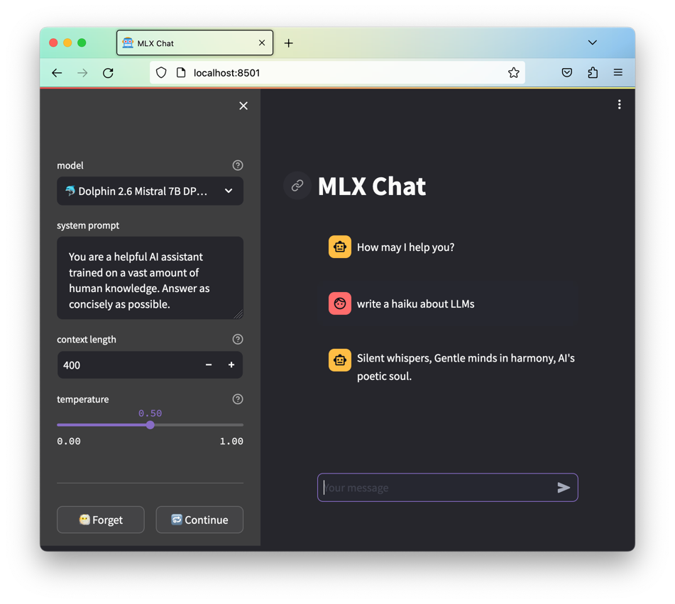

# MLX Chat

A hackish frontend for mlx-lm.



## Install

```shell
$ ./install.sh
```

Or to install using latest versions of the libs (may break functionality):

```shell
$ ./install.sh refresh
```

## Update

After fetching a newer version it's recommended to run again the installation script.

```shell
$ ./install.sh
```

## Run

```shell
$ ./run.sh
```
